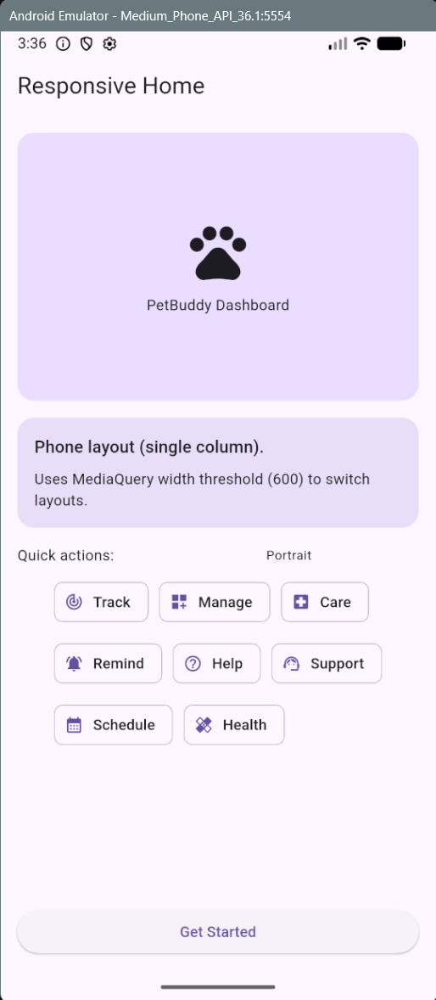

# PetBuddy Responsive Home

## Short Description
This project demonstrates a responsive Flutter UI using `MediaQuery`. The `ResponsiveHome` screen switches layouts based on screen width:
- **Phone layout (width <= 600):** single-column view with `Wrap` for quick actions.
- **Tablet layout (width > 600):** multi-column view with a `Row` and a `GridView`.

It is designed to work in both **portrait and landscape** without overflowing.

## Responsive Logic (MediaQuery Snippet)
```dart
final size = MediaQuery.of(context).size;
final width = size.width;
final isTablet = width > 600;

// Use the same build method, but choose a different layout
// depending on screen width.
if (isTablet) {
  // Tablet: Row + GridView
} else {
  // Phone: Column + Wrap
}
```

## Screenshot
Add your screenshot here:



## Reflection (Learning Flutter & Responsiveness)
- I learned how `MediaQuery` provides screen size and orientation information.
- I learned how to prevent UI overflow using responsive layout choices like:
  - `Expanded` and `Flexible` for adaptive sizing,
  - `AspectRatio` for consistent proportions,
  - `GridView`/`Wrap` so content reflows naturally across orientations.
- Overall, the responsive design makes the same screen usable on phones and tablets.

