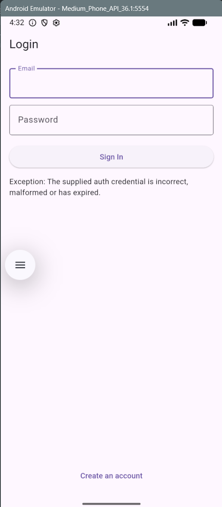

# PetBuddy Firebase Auth + Firestore

## Short Description
This Flutter app demonstrates Firebase integration with:
- **Firebase Authentication** (Email & Password) for signup, login, and logout.
- **Cloud Firestore** for real-time task data using `StreamBuilder` and `.snapshots()`.

## Firebase Setup (Brief)
1. Create a Firebase project in the Firebase Console.
2. Add an Android app and download `google-services.json`.
3. Put the file here: `android/app/google-services.json`.
4. Enable **Email/Password** authentication:
   - Firebase Console -> Authentication -> Sign-in method
5. Ensure dependencies exist in `pubspec.yaml`:
   - `firebase_core`, `firebase_auth`, `cloud_firestore`

## Auth + Firestore Flow

### Firebase Initialization
In `lib/main.dart`, Firebase is initialized using `Firebase.initializeApp()` before any Firebase service is used.

### Authentication
- `SignupScreen` calls `AuthService.signUp(email, password)`
- `LoginScreen` calls `AuthService.signIn(email, password)`
- After successful auth, the app navigates to `DashboardScreen`
- Logout on `DashboardScreen` calls `AuthService.logout()`

### Firestore Real-time Updates
`FirestoreService.tasksStream(uid)` returns a real-time stream of documents:
- collection: `tasks`
- filtered by `uid`
- ordered by `createdAt`

`StreamBuilder` listens to this stream, so the task list updates automatically when documents change.

Example snippet:
```dart
Stream<QuerySnapshot<Map<String, dynamic>>> tasksStream(String uid) {
  return FirebaseFirestore.instance
      .collection('tasks')
      .where('uid', isEqualTo: uid)
      .orderBy('createdAt', descending: true)
      .snapshots();
}
```

## Screenshot
Add your screenshot here:



## Reflection
- I learned how `Firebase.initializeApp()` enables Firebase services in Flutter.
- I learned the Auth flow (signup -> login -> dashboard -> logout) using `FirebaseAuth`.
- I learned how Firestore `.snapshots()` plus `StreamBuilder` creates a reactive UI for real-time data.

